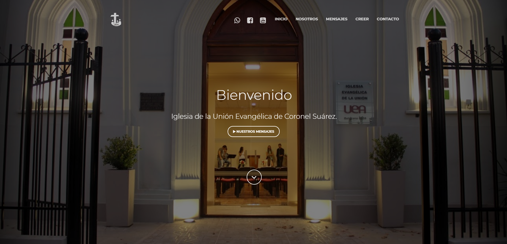
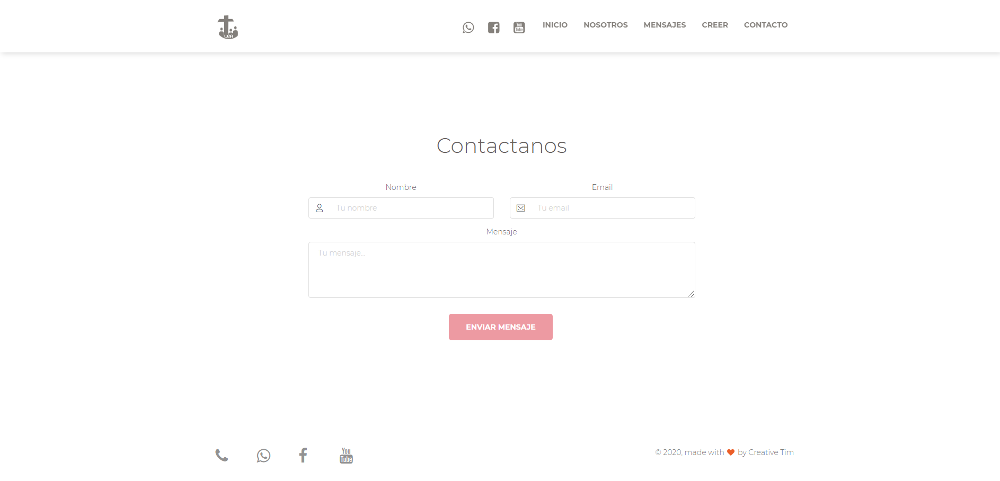
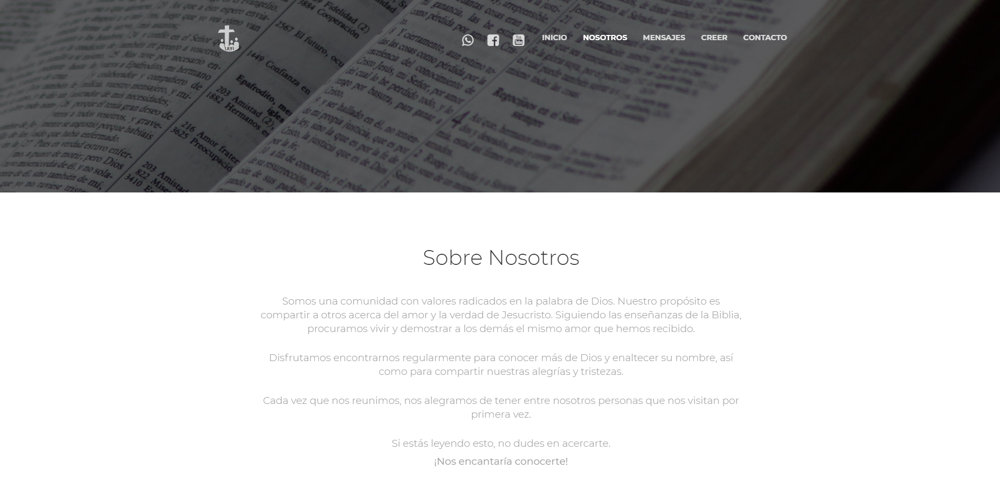
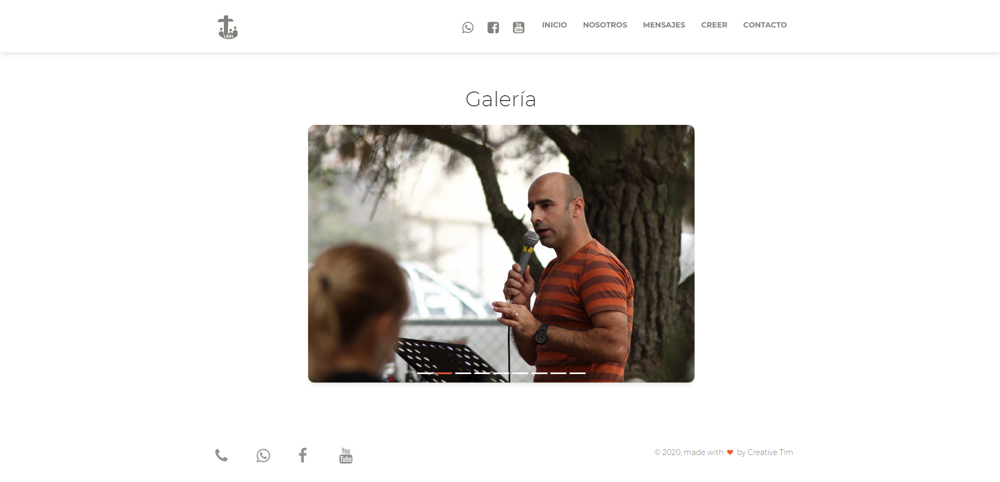
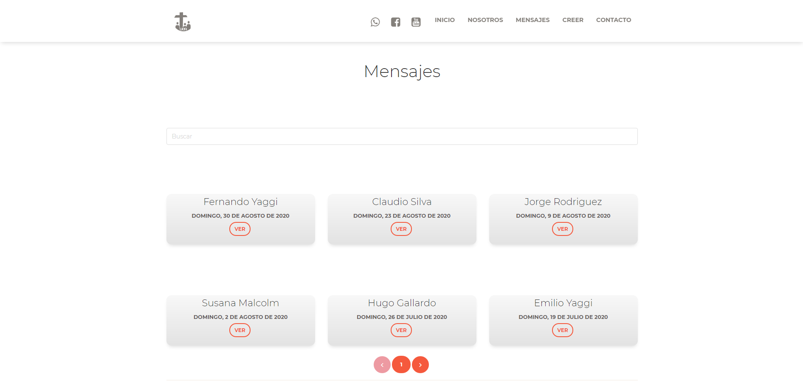

# Iglesia UEA
> An mobile responsive [Angular](https://angular.io/) app with minimalist design for a local church, prerendered with [Scully](https://scully.io/) to achieve the best time to first paint and SEO.


## Table of contents

* [General info](#general-info)
* [Screenshots](#screenshots)
* [Technologies](#technologies)
* [Setup](#setup)
* [Features](#features)
* [Status](#status)
* [Inspiration](#inspiration)
* [Contact](#contact)


## General info

This project was coded for [Iglesia UEA](https://ueasuarez.org/) to provide them with a simple, well looking and fast app, to allow them to get them known and connect with a broader audience. The project was deployed as prerendered static files thanks to [Scully](https://scully.io/), a modern static site generator for [Angular](https://angular.io/) apps. There's a CMS in place handled by [Cloud Firestore](https://firebase.google.com/docs/firestore). The CMS interface can be accessed going to https://ueasuarez.org/login. 

This app was developed having inclusivity in mind, so non-tech or old people can easily use it.


## Screenshots

Image#1: Home




Image#2:  Contact




Image#3: About us




Image#4: About us 




Image#5: Messages



## Technologies

* [Angular](https://angular.io/) - version 9.0.6
* [Scully](https://scully.io/) - version 0.0.94
* [Cloud Firestore](https://firebase.google.com/docs/firestore)


## Setup

Clone or download the repo.

Install all the dependencies listed on the`package.json` file by running:

```
npm install
```

#### **Run the Angular app in the development mode.**

In the project directory, you can run:  

```bash
ng serve
```

Open [http://localhost:4200](http://localhost:4200) to view it in the browser.

The page will reload if you make edits.

You will also see any lint errors in the console.

#### Code scaffolding

Run 

```bash
ng generate component component-name
```

to generate a new component. You can also use

```bash
ng generate directive|pipe|service|class|guard|interface|enum|module
```

#### Angular Build

Run 

```bash
ng build 
```

to build the project. The build artifacts will be stored in the `dist/angular` directory. Use the `--prod` flag for a production build.

#### Scully Build

Now that the Angular project was built, Scully can do its work. Now, run Scully with the following command:

````
npm run scully
````

The Scully-built version of the project is located in the `/dist/static` folder. It contains all the static pages in the project.

#### Serve the Scully App

Now that the Angular project was built, Scully can do its work. Now, run Scully with the following command:

```
npm run scully:serve
```

This command prompts this:

```
starting static server
Scully static server started on "http://localhost:1668/"
Angular distribution server started on "http://localhost:1864/"
```

This command actually launches **2 (two)** servers. The first one is hosting the results of `ng build` (serving the files inside `/dist/angular` and the second server hosts the results of the Scully build (serving the files inside `/dist/static` folder). This allows us to test both versions of our built app.

#### Running unit tests

Run 

````
ng test
````

to execute the unit tests via [Karma](https://karma-runner.github.io).

#### Running end-to-end tests

Run 

```
ng e2e
```

to execute the end-to-end tests via [Protractor](http://www.protractortest.org/).

#### Further help

To get more help on the Angular CLI use `ng help` or go check out the [Angular CLI README](https://github.com/angular/angular-cli/blob/master/README.md).


## Features

List of implemented features:
* Authentication
* Form validation
* Send an email from Google Cloud Functions
* Perform CRUD operations with [Cloud Firestore](https://firebase.google.com/docs/firestore) as part of a custom CMS
* Filter messages by preacher
* Watch the live service on the home screen

List of future improvements:

* Add more info about each ministry, and pictures
* Improve the CMS, so more info can be managed across more ministries.

## Status

Project is _under development_. 


## Inspiration

This project was based on this theme: https://www.creative-tim.com/product/paper-kit-2.


## Contact

Created by [Esteban Munch Jones](https://www.linkedin.com/in/estebanmunchjones/) and [Sebastian Gallardo](https://www.linkedin.com/in/sebastian-gallardo-3aaba12b/) - feel free to contact us.
